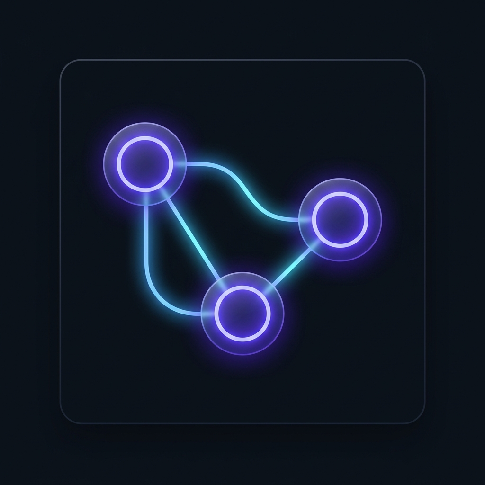

<div align="center">
  

  <h1>Ditto 🧠🕸️</h1>
  
  <p>
    <strong>Duplicate Your AI's Brain — Universal LLM Semantic Sync</strong>
  </p>
  
  <p>
    <a href="https://github.com/Zenkairow/Ditto/releases"></a>
    <a href="https://github.com/Zenkairow/Ditto/stargazers"></a>
    <a href="https://github.com/Zenkairow/Ditto/network/members"></a>
    <a href="https://github.com/Zenkairow/Ditto/blob/main/LICENSE"></a>
  </p>

  <p>
    <em>Never lose context again. A serverless, privacy-first Chrome extension that distills chaotic AI threads into a structured, unbreakable semantic state machine.</em>
  </p>
</div>

---

## 🌪️ The Problem: "Context Collapse"
When you move a massive, highly technical thread from **ChatGPT** to **Claude** (or just start a new session tomorrow), the new model suffers from "Cold Boot Syndrome." 

If you just copy-paste raw transcripts, you waste 80,000+ tokens on conversational noise, formatting artifacts, and redundancies. The AI gets confused, loses the strict implicit persona, and forgets established rules.

## ⚡ The Solution: Ditto
**Ditto** acts as a synaptic bridge between your LLM sessions. It intercepts raw chat logs and runs them through a local **Chain-of-Thought extraction engine** (powered by Gemini). 

Instead of moving raw text, Ditto compiles the session into a dense, token-efficient **7-Pillar Semantic Blueprint** stored securely in your browser's local storage.

<div align="center">
  
  <br>
  <em>Ditto extracting and syncing a chaotic ChatGPT session into a 7-Pillar Blueprint.</em>
</div>

---

## 🏗️ The 7-Pillar Architecture
Ditto doesn't guess; it structures knowledge. Every sync generates a dense Markdown payload organized into:

1. 🎯 **The North Star:** The ultimate strategic objective.
2. 🎭 **The Behavioral Matrix:** The exact implicit persona and tone the AI was using.
3. 🚧 **Environment & Constraints:** Tech stack, budgets, and strict hard-coded rules.
4. 🧠 **The Knowledge Graph:** Deep context, raw math formulas, and architecture diagrams.
5. 📜 **Decision Ledger:** A chronological timeline of agreed milestones.
6. 🪦 **The Graveyard:** Ideas explicitly discarded *(so the new AI doesn't suggest them again)*.
7. 🚀 **The Handoff:** The exact immediate next step.

---

## ✨ Core Features

- 🌐 **Universal Ingestion Protocol:** Seamlessly extracts state from ChatGPT, Claude, DeepSeek, or literally any raw text on the web via our DOM-Scraping engine.
- ✂️ **Role-Weighted Scrubber:** Automatically strips out massive AI code blocks, markdown tables, and redundant HTML *before* processing, reducing token footprint by up to 50%.
- 🔒 **Local-First Privacy:** Powered purely by Chrome's `chrome.storage.local`. Your chat histories never touch an external database or server.
- 🚀 **Zero-Server Setup:** 100% serverless extension. Bring your own Gemini API key and go.
- 🛡️ **Enterprise QA Grade:** Indestructible parsing, rate-limit backoff handling, and zero-XSS DOM sanitization.

---

## 📦 Installation (Developer Preview)

1. Clone or download this repository to your local machine.
   ```bash
   git clone https://github.com/Zenkairow/Ditto.git
   ```
2. Open Chrome and navigate to `chrome://extensions`.
3. Toggle on **Developer mode** in the top right corner.
4. Click **Load unpacked** and select the `extension/` directory.
5. Click the Ditto extension icon, open **Settings**, paste your Gemini API key, and hit **Sync**!

---

## 🛠️ Tech Stack & Security
- **Frontend:** HTML5, TailwindCSS (via CDN for local dashboard), Vanilla JS.
- **Background Logic:** Chrome Service Workers (Manifest V3).
- **LLM Engine:** Gemini 1.5/2.5 REST API.
- **Security:** Strict HTML sanitization on DOM insertion, race-condition locks, and graceful API failure handling. No tracking, no analytics.

---

## 🤝 Contributing
We love community contributions! We are currently looking for contributors to help build out:
- 👁️ **Multi-Modal (Vision) extraction support.**
- 🦊 Firefox compatibility port.
- 🔄 One-click automatic restore payloads.

Please open an issue or submit a Pull Request.

---

<div align="center">
  <p>Built with ❤️ for Power Users.</p>
</div>
